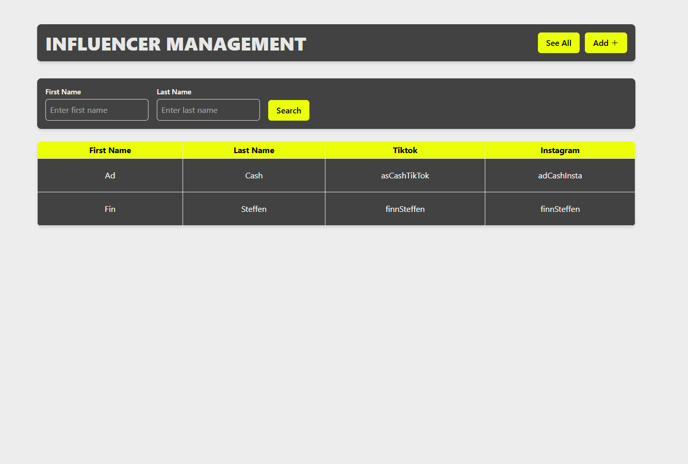
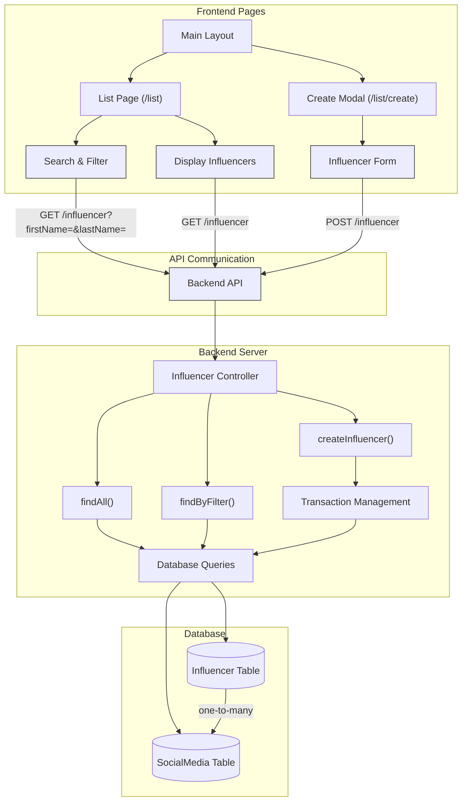

# Influencer Dashboard Adcash

Thank you for the opprotunity to do this ome assignment  
Here is a Screenshot of the Application:


## Setup Instructions

1. `.env` files are checked in for convenience.

Otherwise thy can be created one in root and one in influencer-service with the follwoing content:

```
        DB_HOST=localhost
        DB_PORT=3306
        DB_USERNAME=maria
        DB_PASSWORD=maria123
        DB_NAME=influencer_db
```

Note: For simplicity, we are using two `.env` files here. In an actual build, we would combine them and adjust the code accordingly.

### Running app with docker

2. Run the following command to start the app:

```
docker-compose up -d
```

3. The service should be running at:

- `http://localhost:3000`(Backend)
- `http://localhost:5173`(Frontend)

### Running app locally

2. For the Backend service run the follwing command:

```
npm run start:service
```

3. For the app run the following command:

```
npm run start:app

```

## TechStack

### Frontend

- The application is implemented in **React** and **TypeScript**.
- Additional libraries used: **Vite**, **Vitest**, and **Redux**.

### Backend

- The application is implemented with **NestJS**.
- For the database the SQL Databe **MariaDB** was used

## Structure



### Frontend Structure

- The application has a List Page to view influencers and a Create Route that opens a modal for adding new influencers.

- First name and last name inputs are validated to prevent special characters like @ or \_.

- At least one social media account must be provided.

- Error handling ensures proper type validation while typing and before submission.

- If an influencer is created successfully, the modal closes and redirects to the list.

- The table displays influencer data retrieved from the backend.

- A search feature triggers on:

  - Button Click

  - onBlur event

  - After a short delay (debounce)

### Backend Structure

The backend provides two endpoints:

1. **GET** `/influencer` - Fetch influencers with optional filters (`firstName`, `lastName`).

2. **POST** `/influencer` - Add a new influencer.

An OpenAPI specification is provided [here](openApiSpecs.yml).

The backend connects to a **database with two tables**:

- **Influencer Table** (Stores influencers)

- **SocialMedia Table** (Stores associated social media accounts)

This structure was chosen for scalability, making it easy to add new social media types in the future.

## Testing

Basic test coverage is provided for both the frontend and backend.

- Frontend: Tests implemented with Vitest (the notifications feature is covered).

- Backend: Tests implemented with Jest and Supertest (covering service and controller logic).

Testing can be done with the follwoing Commands:

```bash
For The App
pnpm test:app

For the Service
pnpm test:service
```

## Considerations & Enhancemants

- **Validation**: Implemented in both frontend and backend to allow external integrations in the future.
- **Security**: A security guard (e.g., JWT-based authentication) should be added.
- **Scalability**: Adding new social media types is straightforward.
- **Pagination**: Should be considered for large datasets.
